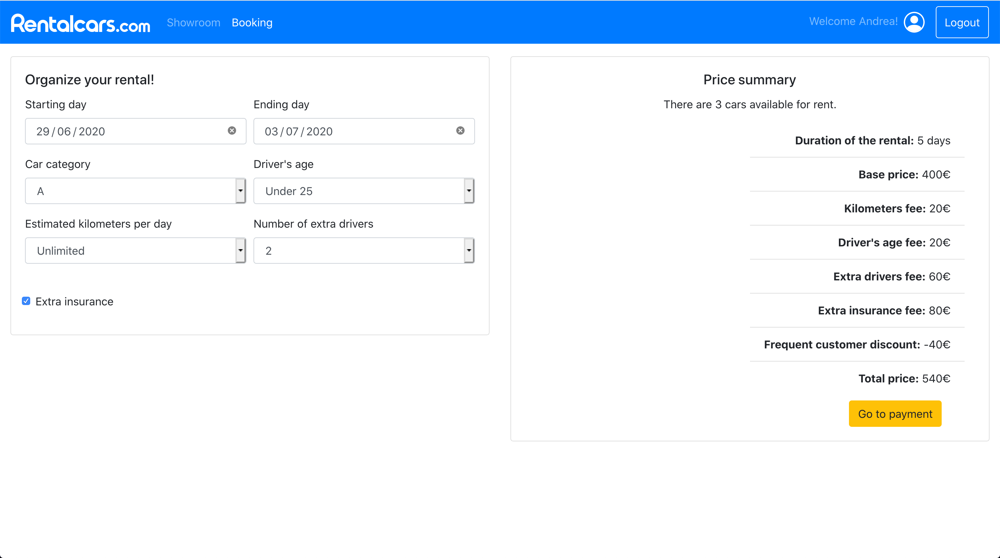

# Exam #1: "Car Rental"
## Student: s280612 Scoppetta Andrea 

## React client application routes

- Route `/showroom`: index of the web application, all the incorrect routes are redirected here. It shows all the
 available cars giving the user the possibility to filter them.
- Route `/booking`: shows the interactive configurator, this page is accessibile only after the login. Here the user can
 select the parameters for his rental and check the pricefor this solution along with the number of cars available for 
 it. When the user confirm theproposed solution it is shown
 a modal where he can insert the payment data and pay. 
- Route `/user/:username`: it's the user dashboard, the param is the name of the user andit's filled automatically if 
the user is authenticated. It shows the past and the future rentals giving the possibility to cancel the future ones.
- Route `/login`: it's a simple error page that it's shown if the user tries to access a reserved
page before the login.

## REST API server

- POST `/api/login`
  - User's username and password
  - User's id and name in case of success, the description of the error in case of error
- POST `/api/logout`
  - Nothing
  - Nothing, it just invalidates the cookie 'token'
- GET `/api/cars`
  - Nothing
  - Cars list
- GET `/api/brands`
  - Nothing
  - Brands list
- GET `/api/user`
  - Nothing
  - User's id and name
- GET `/api/reservations`
  - Nothing
  - User's reservations
- POST `/api/price`
  - Reservation's data in order to calculate the price
  - An object containing the price, the duration, then number of available cars
   and all the applied fees
- POST `/bank/payment`
  - An object containing payment data and reservation data. The payment data is
  verified, the reservation data is used to calculate and then check the price. 
  - The result of the checks
- POST `/api/reservations`
  - The reservation to add to the database
  - The id in the database of the new reservation
- DELETE `/api/reservations/:reservationId`
  - Nothing in the body, the parameter indicates the id of the reservation to delete
  - Nothing in the body, the status code of the result of the operation
  
## Server database

- Table `users` - contains id, username, hash, name
- Table `cars` - contains model, category, brand
- Table `reservations` - contains id, starting day, ending day, car category, driver age,
kilometers per day, extra drivers, extra insurance, price, user

## Main React Components

- `Header` (in `Header.js`): Header of the application, it contains the navigation bar and the
login form in case the user isn't logged in yet, the name with the link to the user dashboard in case
the user is logged in.
- `LoginForm` (in `LoginForm.js`): A small form that receives the username and password and is used to login.
- `PaymentForm` (in `PaymentForm.js`): A modal that has a form that receives name, surname, credit card number and CVV.
- `PriceDialog` (in `PriceDialog.js`): Shows the number of available cars, the detail of the price and the total price.
It also has a button to go the payment.
- `RentalForm` (in `RentalForm.js`): Contains a form that receives all the parameters for the rental.
Once all the parameters are inserted the price is automatically computed and shown.
- `Showroom` (in `Showroom.js`): Shows all cars based on the filter that the user has selected.
- `Sidebar` (in `Sidebar.js`): Contains all the buttons to filter the list of cars by category and brand.
- `UserDashboard` (in `UserDashboard.js`): The user dashboard where he can check past and future rentals and cancel the
future ones.
- `InteractiveConfiguration` (in `InteractiveConfiguration.js`): Contains the `RentalForm`, the `PriceDialog` and the
`PaymentForm` and coordinates them. Furthermore, it implements the methods that these components use to get and send data.

## Screenshot

## Test users

* Andreascopp, andreascopp (frequent customer)
* Marioerre, marioerre
* Stefanoesse, stefanoesse
* Anto97, antonio
* Giova99, giovanni
